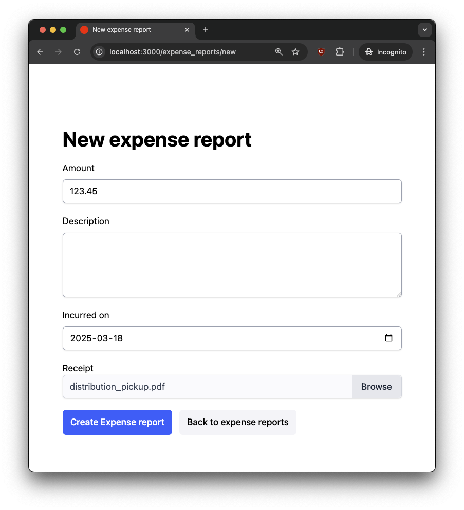
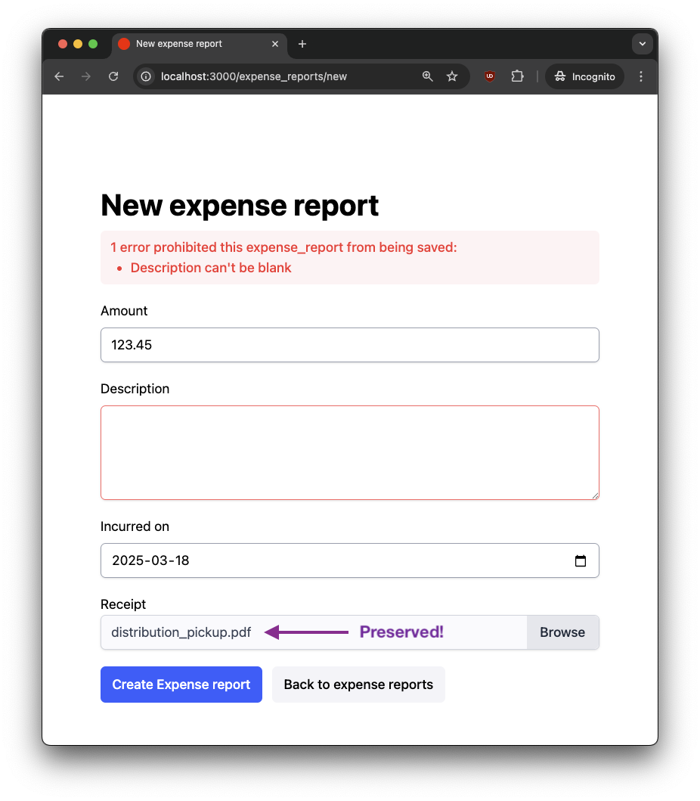

# Expense Tracker

A companion project for a [blog post](https://danielabaron.me/blog/active_storage_form_errors/) demonstrating how to resolve Active Storage file uploads when a form validation occurs.

See [merged PRs](https://github.com/danielabar/expense_tracker/pulls?q=is%3Apr+is%3Aclosed+author%3Adanielabar+sort%3Acreated-asc) to understand the solution step by step.

## Prerequisites

Install Ruby version specified in `.ruby-version` with a Ruby version manager of your choice.

## Setup

```bash
bin/setup
bin/dev
```

App is available at: http://localhost:3000

## Usage

Create a new expense report with an attached receipt, but leave description blank:



The form will re-render with an error message, BUT the receipt attachment is still preserved in the form UI, and will be saved on next successful form submission. This is an improvement over the default behaviour which would require the user to have to select the file again from their file system:


